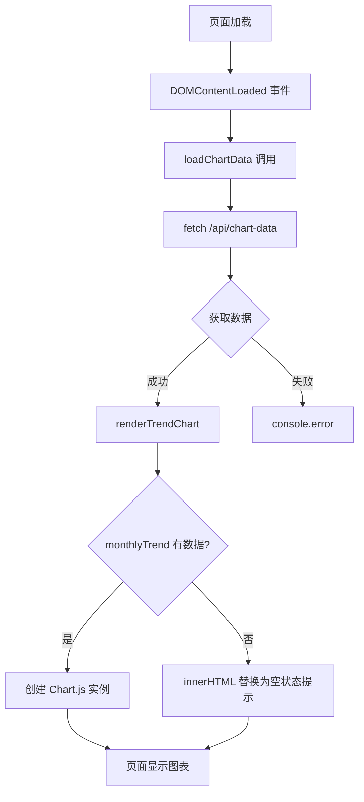

# 知识回顾：简易记账本 DEMO

- **功能标题**：简易记账本 DEMO
- **实现时间**：2026年04月03日 10:34:19
- **更新时间**：2026年04月06日
- **涉及技术**：Express.js、EJS 模板引擎、Node.js ESM、MongoDB + Mongoose 持久化

---

## 1. 功能概述

简易记账本实现了一个完整的账务管理工具：
- **添加账单**：支持日期、类型（收入/支出）、分类、金额、备注
- **查看列表**：按日期降序显示所有账单
- **编辑账单**：修改已有账单的所有字段
- **删除账单**：删除指定账单，带确认提示
- **批量删除**：支持全选/多选批量删除账单
- **按条件查询**：日期范围、类型、分类、金额范围组合筛选
- **分页展示**：支持 5/10/15/30/100 条每页，带页码导航
- **统计功能**：实时计算收入、支出、余额，支持分类统计
- **图表可视化**：支出趋势图（折线图）、分类占比图（环形图）
- **Excel 导出**：导出账单数据为 Excel 文件
- **空状态 UX**：数据为空时显示友好提示
- **数据持久化**：使用 MongoDB + Mongoose 存储，重启后数据保留

---

## 2. 设计思路

### 数据流设计

```
浏览器表单 → Express路由(异步) → accounts.js(Mongoose) → account-book-database(持久化)
     ↑                                      ↓
     └──────────── 渲染 EJS ←──────────────┘
```

### 核心模块划分

| 模块 | 职责 | 文件 |
|------|------|------|
| 路由层 | 接收请求、参数验证、调用业务、返回响应 | routes/index.js |
| 数据层 | CRUD操作、Mongoose持久化、统计计算 | data/accounts.js |
| 视图层 | 页面渲染、表单展示 | views/index.ejs, views/edit.ejs |

### 为什么这样设计？

- **分层职责**：路由不写业务逻辑，业务逻辑独立到 data 模块
- **Mongoose持久化**：使用 Mongoose ODM，Schema 定义数据结构
- **EJS模板**：服务端渲染，简单直接，无需构建工具
- **ESM模块**：现代 Node.js 模块系统

---

## 3. 核心代码解析

### 3.1 路由处理（routes/index.js）

**注意：所有路由处理器都是 async 函数**

```javascript
import express from 'express';
import * as accounts from '../data/accounts.js';

const router = express.Router();

router.get('/', async function (req, res, next) {
  try {
    const accountList = await accounts.getAll();
    const stats = await accounts.getStats();
    const categoryStats = await accounts.getCategoryStats();
    res.render('index', {
      title: '简易记账本',
      accounts: accountList,
      stats,
      categoryStats,
      expenseCategories: accounts.EXPENSE_CATEGORIES,
      error: req.query.error || null,
      success: req.query.success || null
    });
  } catch (err) {
    next(err);
  }
});
```

### 3.2 Mongoose 数据持久化（data/accounts.js）

**定义 Schema 和 Model**
```javascript
import mongoose from 'mongoose';

const accountSchema = new mongoose.Schema({
  id: { type: Number, required: true, unique: true },
  date: { type: String, required: true },
  type: { type: String, required: true, enum: ['income', 'expense'] },
  category: { type: String, default: '' },
  amount: { type: Number, required: true },
  remark: { type: String, default: '' }
}, { versionKey: false });

const Account = mongoose.model('Account', accountSchema);
```

**CRUD 操作示例**
```javascript
// 查询所有账单
export async function getAll() {
  return Account.find({}).sort({ date: -1 });
}

// 添加账单
export async function add(account) {
  const newAccount = new Account({
    id: Date.now(),
    date: account.date,
    type: account.type,
    category: account.category || '',
    amount: parseFloat(account.amount),
    remark: account.remark || ''
  });
  await newAccount.save();
  return newAccount;
}
```

---

## 4. 知识点详解

### 知识点 1：ESM (ECMAScript Modules)

**核心概念**

| 概念 | 代码示例 | 说明 |
|------|---------|------|
| `import` | `import express from 'express'` | 导入模块 |
| `export` | `export default router` | 导出模块 |
| `import.meta.url` | `fileURLToPath(import.meta.url)` | 获取当前文件 URL |
| `__dirname` | 需要通过 `fileURLToPath` 计算 | ESM 中没有 __dirname |

**package.json 配置**
```json
{
  "type": "module"
}
```

**__dirname 的 ESM 替代**
```javascript
import path from 'path';
import { fileURLToPath } from 'url';

const __dirname = path.dirname(fileURLToPath(import.meta.url));
```

---

### 知识点 2：Mongoose ODM

**核心 API**

| 方法 | 说明 |
|------|------|
| `mongoose.connect(uri)` | 建立数据库连接 |
| `new Schema({})` | 定义数据结构 Schema |
| `mongoose.model(name, schema)` | 创建 Model |
| `Model.find({}).sort()` | 查询列表 |
| `new Model(doc).save()` | 插入文档 |
| `Model.findOneAndUpdate()` | 更新文档 |
| `Model.deleteOne()` | 删除文档 |
| `Model.aggregate()` | 聚合统计 |

**Mongoose 优势**

| 方面 | 纯 mongodb 驱动 | Mongoose |
|------|---------------|----------|
| Schema | 无 | 有，数据结构清晰 |
| 验证 | 手动 | 内置数据验证 |
| 中间件 | 无 | 生命周期钩子 |
| 社区 | - | 更流行，答案更多 |

---

### 知识点 3：Express 异步路由

**为什么需要 async/await？**

MongoDB 的 `find()`, `insertOne()` 等操作是异步的，所以路由处理器必须 async：

```javascript
// 错误：同步函数无法 await
router.get('/', function (req, res) {
  const data = await getAll();  // SyntaxError
});

// 正确：async 函数可以 await
router.get('/', async function (req, res) {
  const data = await getAll();  // 正常工作
  res.render('index', { accounts: data });
});
```

**错误处理**
```javascript
router.get('/', async function (req, res, next) {
  try {
    const data = await getAll();
    res.render('index', { accounts: data });
  } catch (err) {
    next(err);  // 传递给 Express 错误处理中间件
  }
});
```

---

## 5. 关键代码位置

| 功能 | 文件路径 | 关键函数/说明 |
|------|---------|--------------|
| 路由处理 | routes/index.js | async route handlers |
| 数据操作 | data/accounts.js | getAll, add, update, remove, getStats, queryByCondition, batchRemove |
| Mongoose 初始化 | data/accounts.js | initializeDb, closeDb, 连接事件监听 |
| 列表页面 | views/index.ejs | 账单循环、统计卡片、查询表单、分页导航 |
| 编辑页面 | views/edit.ejs | 表单预填充 |
| 图表渲染 | public/javascripts/charts.js | renderTrendChart, renderCategoryChart, 空状态处理 |
| 样式 | public/stylesheets/style.css | 统计卡片、列表样式、分页样式、chart-empty |
| Excel 导出 | routes/index.js | GET /export |
| 图表数据 API | routes/index.js | GET /api/chart-data |
| 批量删除 | routes/index.js | POST /batch-delete |

---

## 6. 测试

### 测试文件

| 文件 | 类型 | 测试内容 |
|------|------|---------|
| `__tests__/accounts.test.js` | 单元测试 | 数据层函数 getStats, getCategoryStats |
| `__tests__/app.test.js` | API 测试 | HTTP 路由 (Supertest) |
| `__tests__/account.spec.js` | E2E 测试 | 浏览器自动化测试 (Playwright) |

### 测试命令

```bash
cd account-book
npm test              # 运行 Jest API 测试
npx playwright test   # 运行 E2E 测试（自动启动服务器）
npx playwright show-report  # 查看 HTML 测试报告
```

### Supertest API 测试示例

```javascript
import request from 'supertest';
import app from '../app.js';

describe('API 路由测试', () => {
  it('GET / 应返回 200', async () => {
    const res = await request(app).get('/');
    expect(res.status).toBe(200);
  });

  it('POST /add 应能创建账单', async () => {
    const res = await request(app)
      .post('/add')
      .send({ date: '2024-01-01', type: 'expense', category: '餐饮', amount: 100 });
    expect(res.status).toBe(302);
  });
});
```

### Playwright E2E 测试示例

```javascript
import { test, expect } from '@playwright/test';

test('添加支出账单', async ({ page }) => {
  await page.fill('input[name="date"]', '2026-01-15');
  await page.selectOption('#typeSelect', 'expense');
  await page.fill('input[name="amount"]', '50.00');
  await page.click('button[type="submit"]');

  await expect(page.locator('.message.success')).toContainText('添加成功');
});
```

---

*更新时间：2026年04月06日 - 迁移到 Mongoose ODM 持久化*
*更新时间：2026年04月06日 - 新增 Playwright E2E 测试（15 个测试用例）*
*更新时间：2026年04月06日 - 新增 Supertest API 测试*
*更新时间：2026年04月06日 - 更新为 lowdb v7 持久化 + ESM 模块系统*

---

# 📚 知识回顾：MongoDB 连接事件监听

- **功能标题**：MongoDB 连接事件监听
- **实现时间**：2026年04月06日
- **涉及技术**：Mongoose 连接管理、事件监听器

---

## 1. 功能概述

监听 MongoDB 连接状态变化，输出中文日志：
- **connected**：连接成功
- **disconnected**：连接已断开
- **error**：连接错误
- **reconnected**：重新连接成功

---

## 2. 核心代码

```javascript
import mongoose from 'mongoose';

mongoose.connection.on('connected', () => {
  console.log('[MongoDB] 连接成功');
});

mongoose.connection.on('disconnected', () => {
  console.log('[MongoDB] 连接已断开');
  isConnected = false;
});

mongoose.connection.on('error', (err) => {
  console.error('[MongoDB] 连接错误:', err.message);
});

mongoose.connection.on('reconnected', () => {
  console.log('[MongoDB] 重新连接成功');
});
```

---

## 3. 设计要点

| 事件 | 触发时机 | 典型原因 |
|------|---------|---------|
| connected | `mongoose.connect()` 成功 | 首次连接 |
| disconnected | 服务器关闭/网络中断 | 服务重启、网络故障 |
| error | 连接过程中发生错误 | URI 错误、认证失败 |
| reconnected | 断线后自动重连成功 | 网络恢复 |

**注意**：`disconnected` 事件中需手动设置 `isConnected = false`，因为 Mongoose 不会自动更新该标志。

---

*更新时间：2026年04月06日 - 新增 MongoDB 连接事件监听*

---

# 📚 知识回顾：图表空状态提示

- **功能标题**：图表空状态提示
- **实现时间**：2026年04月06日 12:16:00
- **涉及技术**：Chart.js、DOM 操作、CSS Flexbox、空状态 UX 设计

---

## 1. 功能概述

当账单数据为空时，图表区域不再显示空白画布，而是显示友好的提示文案：
- 支出趋势图：`"暂无支出数据" + "添加账单后即可查看趋势"`
- 支出分类图：`"暂无分类数据" + "添加支出账单后即可查看分类统计"`

**为什么需要这个功能？**
用户看到空白图表会困惑——是加载中？加载失败？还是真的没有数据？空状态提示消除了这种不确定性。

---

## 2. 设计思路

**设计方案**：检测到数据为空时，用 `innerHTML` 替换 `<canvas>` 容器内容为提示 div

**为什么这样设计？**
- Chart.js 在数据为空时不会渲染任何内容，画布保持空白
- 相比隐藏整个图表区域，替换内容更简洁（不需要额外 CSS `display:none`）
- 提示文案放在 `.chart-wrapper` 层级，视觉上保持原布局结构

---

## 3. 核心代码解析

### 3.1 JavaScript 空状态检测

```javascript
function renderTrendChart(monthlyTrend) {
  const ctx = document.getElementById('trendChart');
  const wrapper = ctx?.closest('.chart-wrapper');  // 父容器引用

  if (!ctx) return;

  // 空数据时显示提示
  if (!monthlyTrend || monthlyTrend.length === 0) {
    if (wrapper) {
      wrapper.innerHTML = `
        <div class="chart-empty">
          <p>暂无支出数据</p>
          <span>添加账单后即可查看趋势</span>
        </div>
      `;
    }
    return;  // 关键：return 阻止 Chart() 执行
  }

  new Chart(ctx, { /* 正常渲染逻辑 */ });
}
```

**关键点**：
- `ctx?.closest('.chart-wrapper')` 使用可选链，获取父容器用于内容替换
- `if (!monthlyTrend || monthlyTrend.length === 0)` 同时处理 null/undefined 和空数组
- `return` 在空状态时阻断执行，避免创建空图表实例

### 3.2 CSS 样式

```css
.chart-empty {
  display: flex;
  flex-direction: column;
  align-items: center;
  justify-content: center;  /* 关键：垂直居中 */
  height: 260px;
  color: #999;
  text-align: center;
}

.chart-empty p {
  font-size: 16px;
  margin: 0 0 8px;
  color: #666;
}

.chart-empty span {
  font-size: 13px;
}
```

---

## 4. 实现流程图



---

## 5. 知识点详解

### 知识点1：Chart.js（了解）

**概念详解**：Chart.js 是一个基于 Canvas 的轻量级图表库，支持折线图、饼图、环形图等常见图表类型。

**原理剖析**：
- Chart.js 通过 HTML5 `<canvas>` 元素绑定 2D 绘图上下文
- 数据通过 `data.datasets[0].data` 数组传入
- 当 data 为空数组时，`datasets` 为空，Chart.js 计算出的绘图区域为 0，视觉上就是空白

**应用场景**：趋势展示（折线图）、占比分析（饼图/环形图）、排名对比（柱状图）

### 知识点2：DOM 操作（掌握）

**深层原理**：
- `element.innerHTML` 是**替换性赋值**，会销毁原有所有子元素及其事件监听器
- 如果 canvas 绑定了 Chart.js 实例，直接用 `innerHTML` 替换**不会**调用 `chart.destroy()`
- 本场景可行是因为替换发生在渲染图表**之前**，无需 destroy

**设计决策考量**：
```javascript
// 为什么不隐藏 canvas 显示提示 div？
// 方案A：display:none + 显示提示 div
// 方案B：innerHTML 替换

// 选择方案B的原因：
// 1. 代码更简洁（1行 vs 3行）
// 2. 不需要维护两个状态的 CSS 切换
// 3. 空状态是"替代"而非"叠加"
```

### 知识点3：CSS Flexbox（熟悉）

**核心原理**：Flexbox 布局中，`justify-content` 控制**主轴**方向对齐，`align-items` 控制**交叉轴**对齐。

**常见误区**：
- `justify-content` 在 `flex-direction: column` 时是垂直方向，不是水平方向
- 父容器需要**有明确高度**才能让子元素垂直居中（本例中 `.chart-wrapper` 有 `min-height: 300px`）

### 知识点4：空状态 UX 设计（掌握）

**设计决策考量**：
```
本例的两条文案设计原则：
1. 第一行（p）简短明确 - 说明当前状态
2. 第二行（span）提供行动指引 - 说明如何改善

效果：用户不只是知道"没有数据"，还知道"如何添加数据"
```

---

## 6. 实践建议

根据你的掌握程度，建议：

1. **Chart.js（了解）**：建议动手实践一个小型图表项目，理解数据驱动绑定的核心概念

2. **CSS Flexbox（熟悉）**：可深入学习 `flex-grow/shrink`，掌握自适应布局

---

# 📚 知识回顾：按条件查询 + 分页

- **功能标题**：按条件查询账单 + 分页展示
- **实现时间**：2026年04月06日
- **涉及技术**：Express POST 路由、Mongoose skip/limit、Form 值保留、EJS 动态模板

---

## 1. 功能概述

支持多条件组合查询账单，并分页展示结果：
- **查询条件**：开始日期、结束日期、类型（收入/支出）、分类、金额范围
- **分页参数**：每页条数（5/10/15/30/100）、当前页码
- **结果展示**：显示第 X-Y 条，共 Z 条，支持页码导航

---

## 2. 设计思路

### 数据流设计

```
表单提交(POST) → 路由解析参数 → buildQuery 构建查询对象 → MongoDB skip/limit → 返回 { list, total }
     ↑                                                                                  ↓
     └─────────────────────── EJS 渲染（保留表单值）←───────────────────────────────┘
```

### 核心问题：POST 请求后表单值丢失

**问题**：表单提交后页面刷新，表单恢复默认状态，用户之前输入的条件全部丢失。

**解决方案**：
1. 路由将查询参数 `query` 对象传回视图
2. 视图表单字段设置动态 `value`/`selected` 属性

---

## 3. 核心代码解析

### 3.1 路由层：传递 query 对象

```javascript
router.post('/query', async (req, res, next) => {
  try {
    const { startDate, endDate, type, category, minAmount, maxAmount, page, limit } = req.body;

    const { list: accountList, total } = await accounts.queryByCondition({
      startDate, endDate, type, category, minAmount, maxAmount, page, limit
    });

    const currentPage = page ? parseInt(page) : 1;
    const pageLimit = limit ? parseInt(limit) : 15;

    res.render('index', {
      // ...其他数据
      query: { startDate, endDate, type, category, minAmount, maxAmount },  // 关键：传回查询条件
      currentPage,
      pageLimit,
      total
    });
  } catch (err) {
    next(err);
  }
});
```

### 3.2 视图层：表单值保留

```html
<!-- 输入框保留值 -->
<input type="date" name="startDate" value="<%= typeof query !== 'undefined' ? query.startDate || '' : '' %>">

<!-- Select 保留选中状态 -->
<select name="type">
  <option value="all" <%= typeof query !== 'undefined' && query.type === 'all' ? 'selected' : '' %>>全部</option>
  <option value="expense" <%= typeof query !== 'undefined' && query.type === 'expense' ? 'selected' : '' %>>支出</option>
</select>

<!-- 分页导航：点击页码提交表单，自动携带所有查询条件 -->
<button onclick="goToPage(<%= currentPage %>)">下一页</button>
<script>
function goToPage(pageNum) {
  document.getElementById('queryPage').value = pageNum;
  document.getElementById('queryForm').submit();  // 表单包含所有可见字段
}
</script>
```

### 3.3 MongoDB 分页查询

```javascript
// data/accounts.js
export async function queryByCondition({ page, limit, ...condition }) {
  const query = buildQuery(condition);  // 构建 MongoDB 查询对象

  if (page && limit) {
    const skip = (parseInt(page) - 1) * parseInt(limit);
    const [list, total] = await Promise.all([
      Account.find(query).sort({ date: -1 }).skip(skip).limit(parseInt(limit)),
      Account.countDocuments(query)  // 关键：同时查总数
    ]);
    return { list, total };
  }

  const list = await Account.find(query).sort({ date: -1 });
  return { list, total: list.length };
}
```

**关键点**：
- `skip()` 跳过前 N 条
- `limit()` 限制返回条数
- `countDocuments()` 获取满足条件的总数，用于计算总页数

---

## 4. 知识点详解

### 知识点1：Mongoose skip/limit 分页

**核心原理**：
```javascript
// 第 page 页，每页 limit 条
const skip = (page - 1) * limit;
Account.find(query).skip(skip).limit(limit);
```

**性能注意**：
- 大数据量时 skip 越往后越慢（需要跳过大量文档）
- 解决方案：使用游标分页或基于 ID 的范围查询

### 知识点2：POST 请求表单值保留

**问题本质**：HTTP 是无状态的，POST 跳转后浏览器不自动保留表单值。

**解决方案对比**：

| 方案 | 优点 | 缺点 |
|------|------|------|
| URL 参数 | 简单 | 参数暴露、长度限制 |
| Session/Cookie | 可持久化 | 需要额外存储 |
| 视图重新渲染 | 适合本场景 | 仅限当前请求 |

**本项目选择**：视图重新渲染 + query 对象传递

### 知识点3：EJS 三元表达式处理 undefined

```html
<!-- 安全访问可能不存在的变量 -->
<%= typeof query !== 'undefined' ? query.startDate || '' : '' %>

<!-- 等价于： -->
<% if (typeof query !== 'undefined' && query.startDate) { %>
  <%= query.startDate %>
<% } else { %>
  <%= '' %>
<% } %>
```

---

## 5. 常见错误

### 错误1：表单值不保留

**原因**：路由没有传递 query 对象，或表单字段没有动态 value。

**排查步骤**：
1. 检查路由是否传递 `query` 到视图
2. 检查表单字段是否有 `value="<%= ... %>"` 动态属性
3. 用 curl 测试验证：`curl -X POST -d "startDate=2026-01-01" ...`

### 错误2：切换分页后条件丢失

**原因**：`goToPage()` 只设置了 page，没有提交整个表单。

**正确做法**：
```javascript
function goToPage(pageNum) {
  document.getElementById('queryPage').value = pageNum;
  document.getElementById('queryForm').submit();  // 提交整个表单
}
```

---

## 6. 最佳实践

1. **始终传递 query 对象**：POST 重新渲染时必须保留用户输入
2. **使用 Promise.all 并行查询**：数据和总数一起查，减少数据库往返
3. **表单提交用 POST**：GET 查询有参数长度限制和缓存问题
4. **默认值处理**：page/limit 未传时提供合理的默认值（1 和 15）

---

*更新时间：2026年04月06日 - 新增按条件查询 + 分页功能*

---

# 📚 知识回顾：批量删除

- **功能标题**：批量删除账单
- **实现时间**：2026年04月06日
- **涉及技术**：Express POST 路由、Mongoose deleteMany、Form 表单关联

---

## 1. 功能概述

支持选择多个账单进行批量删除：
- **全选/取消全选**：复选框控制
- **删除确认**：防止误操作
- **异步删除**：一次性删除多条

---

## 2. 核心代码

### 2.1 批量删除路由

```javascript
router.post('/batch-delete', async (req, res, next) => {
  try {
    const { ids } = req.body;
    if (!ids) {
      return res.redirect(buildRedirectUrl('请选择要删除的账单', 'error'));
    }
    const idList = Array.isArray(ids) ? ids : [ids];  // 处理单选/多选
    const count = await accounts.batchRemove(idList);
    res.redirect(buildRedirectUrl(`已删除 ${count} 条账单`, 'success'));
  } catch (err) {
    next(err);
  }
});
```

### 2.2 数据层批量删除

```javascript
export async function batchRemove(ids) {
  const idSet = new Set(ids.map(id => parseInt(id)));
  const result = await Account.deleteMany({ id: { $in: [...idSet] } });
  return result.deletedCount;
}
```

### 2.3 前端复选框关联

```html
<!-- 隐藏表单，关联外部复选框 -->
<form action="/batch-delete" method="POST" id="batchDeleteForm"></form>

<!-- 复选框通过 form 属性关联表单 -->
<input type="checkbox" name="ids" value="<%= account.id %>" form="batchDeleteForm">

<!-- 全选功能 -->
<input type="checkbox" id="selectAll" onclick="toggleSelectAll(this)">

<script>
function toggleSelectAll(source) {
  const checkboxes = document.querySelectorAll('input[name="ids"]');
  checkboxes.forEach(cb => cb.checked = source.checked);
}
</script>
```

---

## 3. 设计要点

**为什么用 `form` 属性关联？**
- 复选框不在 `<form>` 内部，但通过 `form="batchDeleteForm"` 关联
- 保持账单列表结构清晰，无需嵌套表单

**为什么用 `deleteMany({ id: { $in: [...] } })`？**
- `deleteMany` 一次性删除多条，比循环 `deleteOne` 高效
- `$in` 操作符匹配多个 ID 值

---

## 4. 最佳实践

1. **删除前确认**：防止用户误删
2. **处理空选择**：未选择时提示用户
3. **处理单选情况**：`Array.isArray(ids) ? ids : [ids]`
4. **返回删除数量**：让用户知道操作结果

---

*更新时间：2026年04月06日 - 新增批量删除功能*

