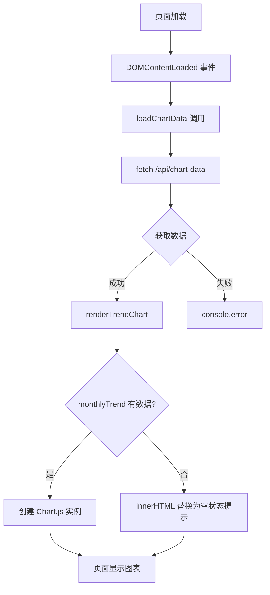

# 知识回顾：简易记账本 DEMO

- **功能标题**：简易记账本 DEMO
- **实现时间**：2026年04月03日 10:34:19
- **更新时间**：2026年04月06日
- **涉及技术**：Express.js、EJS 模板引擎、Node.js ESM、lowdb v7 持久化

---

## 1. 功能概述

简易记账本实现了一个基本的账务管理工具：
- **添加账单**：支持日期、类型（收入/支出）、分类、金额、备注
- **查看列表**：按日期降序显示所有账单
- **编辑账单**：修改已有账单的所有字段
- **删除账单**：删除指定账单，带确认提示
- **统计功能**：实时计算收入、支出、余额，支持分类统计
- **数据持久化**：使用 lowdb 存储到 JSON 文件，重启后数据保留

---

## 2. 设计思路

### 数据流设计

```
浏览器表单 → Express路由(异步) → accounts.js(lowdb) → accounts.json(持久化)
     ↑                                      ↓
     └──────────── 渲染 EJS ←──────────────┘
```

### 核心模块划分

| 模块 | 职责 | 文件 |
|------|------|------|
| 路由层 | 接收请求、参数验证、调用业务、返回响应 | routes/index.js |
| 数据层 | CRUD操作、lowdb持久化、统计计算 | data/accounts.js |
| 视图层 | 页面渲染、表单展示 | views/index.ejs, views/edit.ejs |

### 为什么这样设计？

- **分层职责**：路由不写业务逻辑，业务逻辑独立到 data 模块
- **lowdb持久化**：DEMO级别无需数据库，lowdb 提供内存缓存+懒写入
- **EJS模板**：服务端渲染，简单直接，无需构建工具
- **ESM模块**：现代 Node.js 模块系统，与 lowdb v7 兼容

---

## 3. 核心代码解析

### 3.1 路由处理（routes/index.js）

**注意：所有路由处理器都是 async 函数**

```javascript
import express from 'express';
import * as accounts from '../data/accounts.js';

const router = express.Router();

router.get('/', async function (req, res, next) {
  try {
    const accountList = await accounts.getAll();
    const stats = await accounts.getStats();
    const categoryStats = await accounts.getCategoryStats();
    res.render('index', {
      title: '简易记账本',
      accounts: accountList,
      stats,
      categoryStats,
      expenseCategories: accounts.EXPENSE_CATEGORIES,
      error: req.query.error || null,
      success: req.query.success || null
    });
  } catch (err) {
    next(err);
  }
});
```

### 3.2 lowdb 数据持久化（data/accounts.js）

**初始化 lowdb**
```javascript
import { Low } from 'lowdb';
import { JSONFile } from 'lowdb/node';
import path from 'path';
import { fileURLToPath } from 'url';

const __dirname = path.dirname(fileURLToPath(import.meta.url));
const DATA_FILE = path.join(__dirname, 'accounts.json');

async function initDb() {
  const adapter = new JSONFile(DATA_FILE);
  const db = new Low(adapter, { accounts: [] });
  await db.read();
  return db;
}

// 单例模式
let dbPromise = null;
async function getDb() {
  if (!dbPromise) {
    dbPromise = initDb();
  }
  return dbPromise;
}
```

**CRUD 操作示例**
```javascript
export async function getAll() {
  const db = await getDb();
  const accounts = db.data.accounts || [];
  return accounts.sort((a, b) => new Date(b.date) - new Date(a.date));
}

export async function add(account) {
  const db = await getDb();
  const newAccount = {
    id: Date.now(),
    date: account.date,
    type: account.type,
    category: account.category || '',
    amount: parseFloat(account.amount),
    remark: account.remark || ''
  };
  db.data.accounts.push(newAccount);
  await db.write();  // lowdb 自动将更改写入文件
  return newAccount;
}
```

---

## 4. 知识点详解

### 知识点 1：ESM (ECMAScript Modules)

**核心概念**

| 概念 | 代码示例 | 说明 |
|------|---------|------|
| `import` | `import express from 'express'` | 导入模块 |
| `export` | `export default router` | 导出模块 |
| `import.meta.url` | `fileURLToPath(import.meta.url)` | 获取当前文件 URL |
| `__dirname` | 需要通过 `fileURLToPath` 计算 | ESM 中没有 __dirname |

**package.json 配置**
```json
{
  "type": "module"
}
```

**__dirname 的 ESM 替代**
```javascript
import path from 'path';
import { fileURLToPath } from 'url';

const __dirname = path.dirname(fileURLToPath(import.meta.url));
```

---

### 知识点 2：lowdb v7

**核心 API**

| 方法 | 说明 |
|------|------|
| `new JSONFile(path)` | 创建 JSON 文件适配器 |
| `new Low(adapter, defaultData)` | 创建 lowdb 实例 |
| `await db.read()` | 从文件读取数据到内存 |
| `await db.write()` | 将内存数据写入文件 |
| `db.data.accounts` | 访问数据（自动类型推断） |

**lowdb vs 手动 fs**

| 方面 | 手动 fs | lowdb |
|------|--------|-------|
| 文件读取 | 每次操作都读 | 启动时读一次，内存缓存 |
| 文件写入 | 每次操作都写 | 懒写入（调用 write() 时） |
| 代码量 | 需要 readFromFile/writeToFile | 内置 |
| 原子性 | 无 | 支持事务 |

---

### 知识点 3：Express 异步路由

**为什么需要 async/await？**

lowdb 的 `db.read()` 和 `db.write()` 是异步的，所以路由处理器必须 async：

```javascript
// 错误：同步函数无法 await
router.get('/', function (req, res) {
  const data = await getAll();  // SyntaxError
});

// 正确：async 函数可以 await
router.get('/', async function (req, res) {
  const data = await getAll();  // 正常工作
  res.render('index', { accounts: data });
});
```

**错误处理**
```javascript
router.get('/', async function (req, res, next) {
  try {
    const data = await getAll();
    res.render('index', { accounts: data });
  } catch (err) {
    next(err);  // 传递给 Express 错误处理中间件
  }
});
```

---

## 5. 关键代码位置

| 功能 | 文件路径 | 关键函数 |
|------|---------|---------|
| 路由处理 | routes/index.js | async route handlers |
| 数据操作 | data/accounts.js | getAll, add, update, remove, getStats |
| lowdb 初始化 | data/accounts.js | initDb, getDb |
| 列表页面 | views/index.ejs | 账单循环、统计卡片 |
| 编辑页面 | views/edit.ejs | 表单预填充 |
| 样式 | public/stylesheets/style.css | 统计卡片、列表样式 |

---

## 6. 测试

### 测试文件

| 文件 | 类型 | 测试内容 |
|------|------|---------|
| `__tests__/accounts.test.js` | 单元测试 | 数据层函数 getStats, getCategoryStats |
| `__tests__/app.test.js` | API 测试 | HTTP 路由 (Supertest) |
| `__tests__/account.spec.js` | E2E 测试 | 浏览器自动化测试 (Playwright) |

### 测试命令

```bash
cd account-book
npm test              # 运行 Jest API 测试
npx playwright test   # 运行 E2E 测试（自动启动服务器）
npx playwright show-report  # 查看 HTML 测试报告
```

### Supertest API 测试示例

```javascript
import request from 'supertest';
import app from '../app.js';

describe('API 路由测试', () => {
  it('GET / 应返回 200', async () => {
    const res = await request(app).get('/');
    expect(res.status).toBe(200);
  });

  it('POST /add 应能创建账单', async () => {
    const res = await request(app)
      .post('/add')
      .send({ date: '2024-01-01', type: 'expense', category: '餐饮', amount: 100 });
    expect(res.status).toBe(302);
  });
});
```

### Playwright E2E 测试示例

```javascript
import { test, expect } from '@playwright/test';

test('添加支出账单', async ({ page }) => {
  await page.fill('input[name="date"]', '2026-01-15');
  await page.selectOption('#typeSelect', 'expense');
  await page.fill('input[name="amount"]', '50.00');
  await page.click('button[type="submit"]');

  await expect(page.locator('.message.success')).toContainText('添加成功');
});
```

---

*更新时间：2026年04月06日 - 新增 Playwright E2E 测试（15 个测试用例）*
*更新时间：2026年04月06日 - 新增 Supertest API 测试*
*更新时间：2026年04月06日 - 更新为 lowdb v7 持久化 + ESM 模块系统*

---

# 📚 知识回顾：图表空状态提示

- **功能标题**：图表空状态提示
- **实现时间**：2026年04月06日 12:16:00
- **涉及技术**：Chart.js、DOM 操作、CSS Flexbox、空状态 UX 设计

---

## 1. 功能概述

当账单数据为空时，图表区域不再显示空白画布，而是显示友好的提示文案：
- 支出趋势图：`"暂无支出数据" + "添加账单后即可查看趋势"`
- 支出分类图：`"暂无分类数据" + "添加支出账单后即可查看分类统计"`

**为什么需要这个功能？**
用户看到空白图表会困惑——是加载中？加载失败？还是真的没有数据？空状态提示消除了这种不确定性。

---

## 2. 设计思路

**设计方案**：检测到数据为空时，用 `innerHTML` 替换 `<canvas>` 容器内容为提示 div

**为什么这样设计？**
- Chart.js 在数据为空时不会渲染任何内容，画布保持空白
- 相比隐藏整个图表区域，替换内容更简洁（不需要额外 CSS `display:none`）
- 提示文案放在 `.chart-wrapper` 层级，视觉上保持原布局结构

---

## 3. 核心代码解析

### 3.1 JavaScript 空状态检测

```javascript
function renderTrendChart(monthlyTrend) {
  const ctx = document.getElementById('trendChart');
  const wrapper = ctx?.closest('.chart-wrapper');  // 父容器引用

  if (!ctx) return;

  // 空数据时显示提示
  if (!monthlyTrend || monthlyTrend.length === 0) {
    if (wrapper) {
      wrapper.innerHTML = `
        <div class="chart-empty">
          <p>暂无支出数据</p>
          <span>添加账单后即可查看趋势</span>
        </div>
      `;
    }
    return;  // 关键：return 阻止 Chart() 执行
  }

  new Chart(ctx, { /* 正常渲染逻辑 */ });
}
```

**关键点**：
- `ctx?.closest('.chart-wrapper')` 使用可选链，获取父容器用于内容替换
- `if (!monthlyTrend || monthlyTrend.length === 0)` 同时处理 null/undefined 和空数组
- `return` 在空状态时阻断执行，避免创建空图表实例

### 3.2 CSS 样式

```css
.chart-empty {
  display: flex;
  flex-direction: column;
  align-items: center;
  justify-content: center;  /* 关键：垂直居中 */
  height: 260px;
  color: #999;
  text-align: center;
}

.chart-empty p {
  font-size: 16px;
  margin: 0 0 8px;
  color: #666;
}

.chart-empty span {
  font-size: 13px;
}
```

---

## 4. 实现流程图



---

## 5. 知识点详解

### 知识点1：Chart.js（了解）

**概念详解**：Chart.js 是一个基于 Canvas 的轻量级图表库，支持折线图、饼图、环形图等常见图表类型。

**原理剖析**：
- Chart.js 通过 HTML5 `<canvas>` 元素绑定 2D 绘图上下文
- 数据通过 `data.datasets[0].data` 数组传入
- 当 data 为空数组时，`datasets` 为空，Chart.js 计算出的绘图区域为 0，视觉上就是空白

**应用场景**：趋势展示（折线图）、占比分析（饼图/环形图）、排名对比（柱状图）

### 知识点2：DOM 操作（掌握）

**深层原理**：
- `element.innerHTML` 是**替换性赋值**，会销毁原有所有子元素及其事件监听器
- 如果 canvas 绑定了 Chart.js 实例，直接用 `innerHTML` 替换**不会**调用 `chart.destroy()`
- 本场景可行是因为替换发生在渲染图表**之前**，无需 destroy

**设计决策考量**：
```javascript
// 为什么不隐藏 canvas 显示提示 div？
// 方案A：display:none + 显示提示 div
// 方案B：innerHTML 替换

// 选择方案B的原因：
// 1. 代码更简洁（1行 vs 3行）
// 2. 不需要维护两个状态的 CSS 切换
// 3. 空状态是"替代"而非"叠加"
```

### 知识点3：CSS Flexbox（熟悉）

**核心原理**：Flexbox 布局中，`justify-content` 控制**主轴**方向对齐，`align-items` 控制**交叉轴**对齐。

**常见误区**：
- `justify-content` 在 `flex-direction: column` 时是垂直方向，不是水平方向
- 父容器需要**有明确高度**才能让子元素垂直居中（本例中 `.chart-wrapper` 有 `min-height: 300px`）

### 知识点4：空状态 UX 设计（掌握）

**设计决策考量**：
```
本例的两条文案设计原则：
1. 第一行（p）简短明确 - 说明当前状态
2. 第二行（span）提供行动指引 - 说明如何改善

效果：用户不只是知道"没有数据"，还知道"如何添加数据"
```

---

## 6. 实践建议

根据你的掌握程度，建议：

1. **Chart.js（了解）**：建议动手实践一个小型图表项目，理解数据驱动绑定的核心概念

2. **CSS Flexbox（熟悉）**：可深入学习 `flex-grow/shrink`，掌握自适应布局
