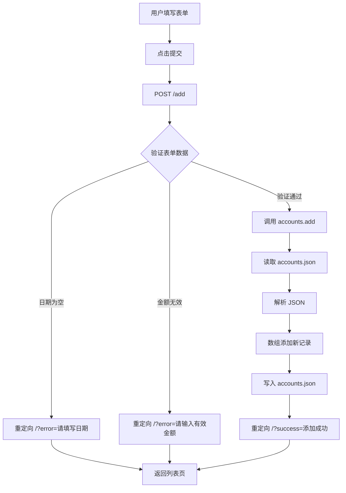
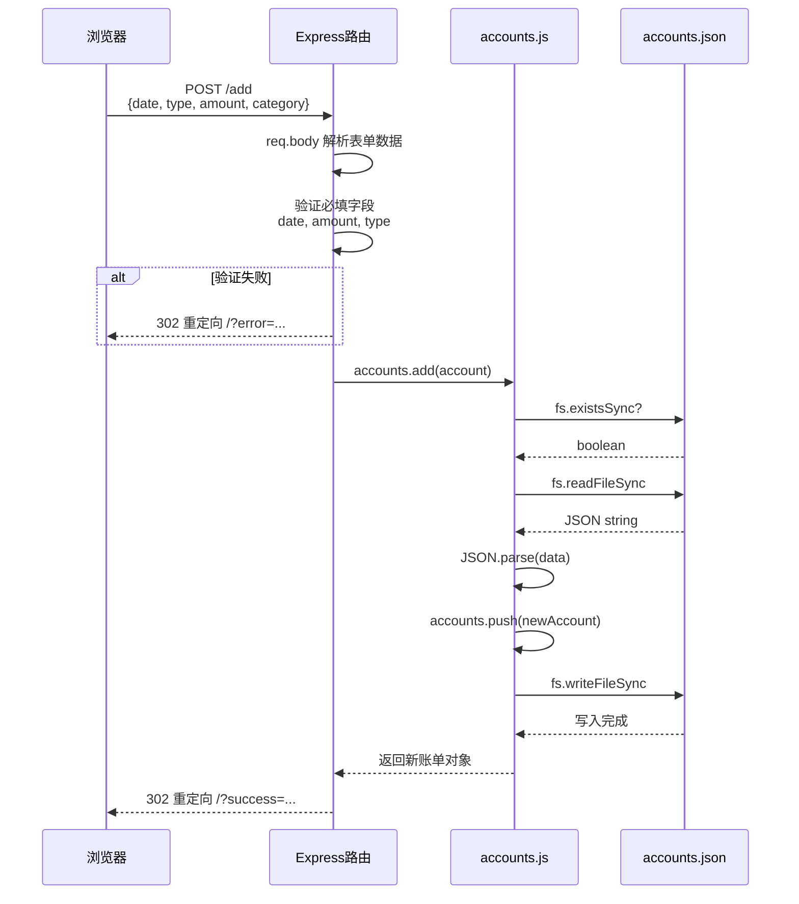

# 📚 知识回顾：简易记账本 DEMO

- **功能标题**：简易记账本 DEMO
- **实现时间**：2026年04月03日 10:34:19
- **涉及技术**：Express.js、EJS 模板引擎、Node.js fs 模块、JSON 持久化

---

## 1. 功能概述

简易记账本实现了一个基本的账务管理工具：
- **添加账单**：支持日期、类型（收入/支出）、分类、金额、备注
- **查看列表**：按日期降序显示所有账单
- **编辑账单**：修改已有账单的所有字段
- **删除账单**：删除指定账单，带确认提示
- **统计功能**：实时计算收入、支出、余额，支持分类统计
- **数据持久化**：JSON 文件存储，重启后数据保留

---

## 2. 设计思路

### 数据流设计

```
浏览器表单 → Express路由 → accounts.js(业务逻辑) → accounts.json(持久化)
     ↑                                      ↓
     └──────────── 渲染 EJS ←──────────────┘
```

### 核心模块划分

| 模块 | 职责 | 文件 |
|------|------|------|
| 路由层 | 接收请求、参数验证、调用业务、返回响应 | routes/index.js |
| 数据层 | CRUD操作、文件读写、统计计算 | data/accounts.js |
| 视图层 | 页面渲染、表单展示 | views/index.ejs, views/edit.ejs |

### 为什么这样设计？

- **分层职责**：路由不写业务逻辑，业务逻辑独立到 data 模块
- **JSON存储**：DEMO级别无需数据库，文件存储足够
- **EJS模板**：服务端渲染，简单直接，无需构建工具

---

## 3. 核心代码解析

### 3.1 路由处理（routes/index.js）

**GET / - 显示账单列表**
```javascript
router.get("/", function (req, res, next) {
  const accountList = accounts.getAll();
  const stats = accounts.getStats();
  const categoryStats = accounts.getCategoryStats();
  res.render("index", {
    title: "简易记账本",
    accounts: accountList,
    stats,
    categoryStats,
    expenseCategories: accounts.EXPENSE_CATEGORIES,
    error: req.query.error || null,
    success: req.query.success || null
  });
});
```

**POST /add - 添加账单**
```javascript
router.post("/add", function (req, res, next) {
  const { date, type, category, amount, remark } = req.body;

  // 验证 - 及时 return 避免后续执行
  if (!date || !amount) {
    return res.redirect("/?error=" + encodeURIComponent("请填写日期和金额"));
  }

  const amountValue = parseFloat(amount);
  if (isNaN(amountValue) || amountValue <= 0) {
    return res.redirect("/?error=" + encodeURIComponent("请输入有效的金额"));
  }

  // ... 更多验证 ...

  accounts.add(account);
  res.redirect("/?success=" + encodeURIComponent("添加成功"));
});
```

### 3.2 数据持久化（data/accounts.js）

**读取文件**
```javascript
function readFromFile() {
  try {
    if (!fs.existsSync(DATA_FILE)) {
      return [];  // 文件不存在返回空数组
    }
    const data = fs.readFileSync(DATA_FILE, 'utf-8');
    return JSON.parse(data) || [];
  } catch (error) {
    console.error('读取账单文件失败:', error);
    return [];
  }
}
```

**写入文件**
```javascript
function writeToFile(accounts) {
  try {
    fs.writeFileSync(DATA_FILE, JSON.stringify(accounts, null, 2), 'utf-8');
    return true;
  } catch (error) {
    console.error('写入账单文件失败:', error);
    return false;
  }
}
```

---

## 4. 流程/时序图

### 添加账单流程图



### 添加账单时序图



---

## 5. 知识点详解

### 知识点 1：Express.js 路由

**核心原理（熟悉级别）**

| 概念 | 代码示例 | 说明 |
|------|---------|------|
| `express.Router()` | `var router = express.Router()` | 创建路由实例 |
| `req.body` | `const { date, amount } = req.body` | POST 请求体数据 |
| `req.params` | `req.params.id` | URL 路径参数 |
| `req.query` | `req.query.error` | URL query 参数 |
| `res.redirect()` | `res.redirect("/?error=...")` | 302 重定向 |
| `res.render()` | `res.render("index", {...})` | 渲染 EJS 模板 |

**关键：req.body 需要中间件支持**

```javascript
// app.js 中必须配置
app.use(express.urlencoded({ extended: false })); // 解析表单数据
app.use(express.json()); // 解析 JSON
```

**最佳实践**

1. **及时 return** - 验证失败时立即 return
```javascript
// 错误 - 验证失败后继续执行
if (!date) {
    res.redirect("/?error=请填日期");
}
// 后面代码继续执行！

// 正确 - return 终止执行
if (!date) {
    return res.redirect("/?error=请填日期");
}
```

2. **中文编码** - 重定向消息用 encodeURIComponent
```javascript
res.redirect("/?error=" + encodeURIComponent("请填写日期"));
```

3. **路由参数验证** - 检查 params 是否有效
```javascript
router.get("/edit/:id", function(req, res) {
    const account = accounts.getById(req.params.id);
    if (!account) {
        return res.redirect("/?error=账单不存在");
    }
    // ...
});
```

---

### 知识点 3：Node.js fs 模块

**核心原理（熟悉级别）**

**同步文件操作方法**

| 方法 | 返回值 | 说明 |
|------|--------|------|
| `fs.existsSync(path)` | `boolean` | 检查文件是否存在 |
| `fs.readFileSync(path, 'utf-8')` | `string` | 读取文件内容 |
| `fs.writeFileSync(path, data)` | `undefined` | 写入文件（覆盖） |
| `fs.mkdirSync(path, {recursive})` | `undefined` | 创建目录 |

**JSON 序列化操作**

```javascript
// 对象 → JSON 字符串（写入文件）
const jsonStr = JSON.stringify(accounts, null, 2);
// 参数说明：
//   null - 不过滤任何属性
//   2    - 缩进2个空格（美化格式，便于阅读）

// JSON 字符串 → 对象（读取文件）
const accounts = JSON.parse(data);
```

**常见错误处理模式**

```javascript
function readFromFile() {
  try {
    // 1. 检查文件是否存在
    if (!fs.existsSync(DATA_FILE)) {
      return [];
    }
    // 2. 读取文件
    const data = fs.readFileSync(DATA_FILE, 'utf-8');
    // 3. 解析 JSON（空字符串会抛异常）
    return JSON.parse(data) || [];
  } catch (error) {
    console.error('读取失败:', error);
    return [];  // 返回默认值，不让程序崩溃
  }
}
```

**必须 try-catch 的场景**

```javascript
// JSON.parse("") → SyntaxError
// JSON.parse("{invalid}") → SyntaxError
// fs.readFileSync("不存在的文件") → 正常返回空字符串
// fs.writeFileSync(...) → 可能抛权限错误
```

**写入是覆盖，不是追加**

```javascript
const accounts = [{id: 1}];
fs.writeFileSync('test.json', JSON.stringify(accounts));
// 再写入 [{id:2}]，第一个内容会丢失
```

---

## 6. 实践建议

###  Express 路由 - 进阶学习方向

| 当前掌握 | 建议学习内容 |
|---------|-------------|
| 熟悉 | 中间件编写 `app.use()` |
| 熟悉 | 错误中间件 `app.use((err,req,res,next)=>{})` |
| 熟悉 | 路由模块化（抽离子路由） |

**推荐练习**
- 尝试添加日志中间件：记录每个请求的 URL 和时间
- 尝试添加错误处理中间件：统一返回 JSON 格式错误

### Node.js fs - 进阶学习方向

| 当前掌握 | 建议学习内容 |
|---------|-------------|
| 熟悉 | 异步文件操作 `fs.promises.readFile()` |
| 熟悉 | 文件流 `fs.createReadStream()` |
| 熟悉 | 路径处理 `path.join()` vs 字符串拼接 |

**推荐练习**
- 将 fs 方法改为异步版本（使用 `fs.promises`）
- 添加文件备份功能：每次写入前复制一份备份

### 薄弱环节自查清单

- [ ] 能解释 `req.body`、`req.params`、`req.query` 的区别吗？
- [ ] 知道为什么验证失败要用 `return res.redirect()` 吗？
- [ ] 能手写一个读取 JSON 文件并返回数组的函数吗？
- [ ] 知道 `JSON.stringify(obj, null, 2)` 中 null 和 2 的含义吗？

---

## 7. 关键代码位置

| 功能 | 文件路径 | 关键函数 |
|------|---------|---------|
| 路由处理 | routes/index.js | router.get/post |
| 数据操作 | data/accounts.js | getAll, add, update, remove, getStats |
| 列表页面 | views/index.ejs | 账单循环、统计卡片 |
| 编辑页面 | views/edit.ejs | 表单预填充 |
| 样式 | public/stylesheets/style.css | 统计卡片、列表样式 |

---

*生成时间：2026年04月03日 10:34:19*
